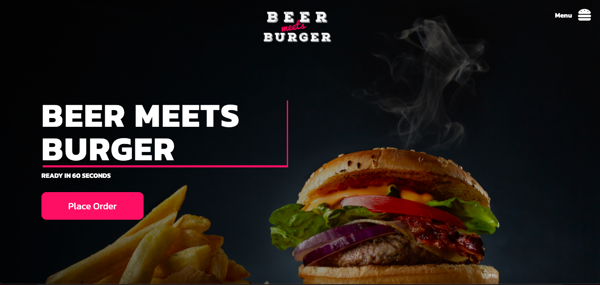
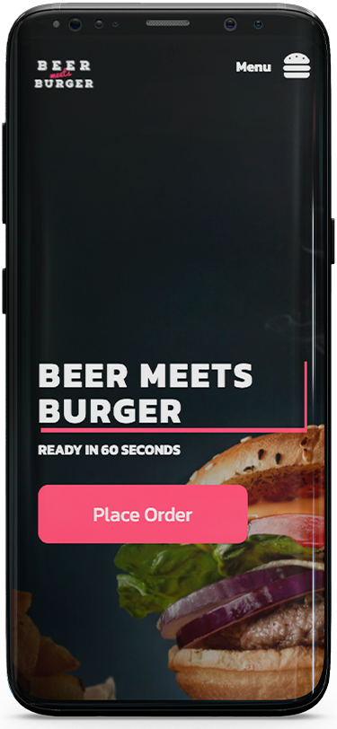

<h1 align="center">
    
</h1>

<h4 align="center"> 
 ⚡️ DeliveryBurger ⚡️ Desenvolvendo...
</h4>

## 💻 Sobre o projeto

⚡️ DeliveryBurger - Projeto desenvolvido para delivery de restaurante.

Projeto desenvolvido com Reactjs.
Ótimo desafio e aprendizado..

### Mobile

<p align="center">
  
</p>

### Web

<p align="center" style="display: flex; align-items: flex-start; justify-content: center;">
  
</p>

## 🛠 Tecnologias

As seguintes ferramentas foram usadas na construção do projeto:

- [Node.js][nodejs]

## ⚡️ Como executar o projeto

### Pré-requisitos

Antes de começar, você vai precisar ter instalado em sua máquina as seguintes ferramentas:
[Git](https://git-scm.com).
Além disto é bom ter um editor para trabalhar com o código como [VSCode][vscode]

### 🧭 Rodando a aplicação web (Front End)

```bash
# Clone este repositório
$ git clone https://github.com/CristianoBV/Delivery_Hamburger

# Acesse a pasta do projeto no terminal/cmd
$ cd hamburger

# Instale as dependências
$ yarn install

# Execute a aplicação em modo de desenvolvimento
$ yarn start

# O servidor inciará na porta:3333 - acesse http://localhost:3333
```

## 📝 Licença

Este projeto esta sobe a licença.

Feito com ❤️ por cristiano Borges 👋🏽 [Entre em contato!](https://www.linkedin.com/in/cristianobv/)

[reactjs]: https://reactjs.org
[yarn]: https://yarnpkg.com/
[vscode]: https://code.visualstudio.com/
[vceditconfig]: https://marketplace.visualstudio.com/items?itemName=EditorConfig.EditorConfig
[license]: https://github.com/CristianoBV/privacy_policy
[vceslint]: https://marketplace.visualstudio.com/items?itemName=dbaeumer.vscode-eslint
